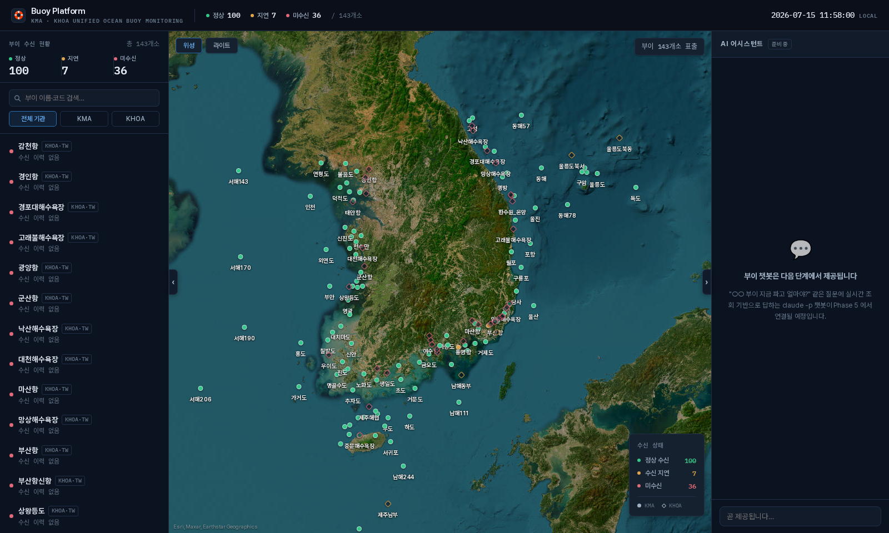
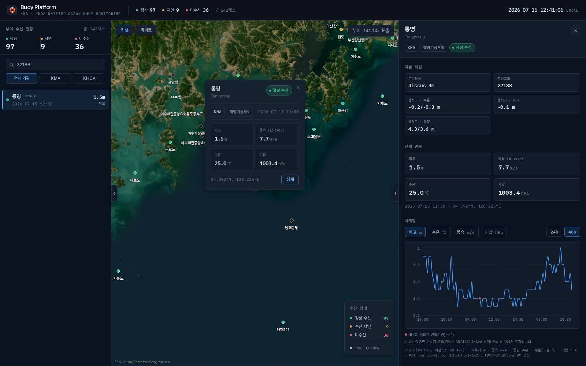

# Buoy Platform — 다기관 해양부이 통합 모니터링 플랫폼

> 여러 기관(기상청·국립해양조사원)의 해상 부이를 지도 위에서 실시간 모니터링하고, 알고리즘/AI 기반 시계열 QC 와 24시간 예측을 함께 표출하는 **시연용** 플랫폼.

한반도 주변 해역의 해양기상부이·파고부이(기상청)와 해양관측부이(국립해양조사원)를 하나의 위성 지도에 모아, 수신 상태·실시간 관측값·시계열·이상치(QC)를 한눈에 확인할 수 있게 한다.

<p>
  
  
</p>

## 주요 기능

- **지도 모니터링** — 위성 다크맵(+화이트 토글) 위에 기관/종류별 부이 마커. 수신 상태(정상 수신 / 수신 지연 / 미수신)를 색으로 표시.
- **부이 팝업 & 상세** — 클릭 시 기본 관측값 팝업 → 상세 드로어(지점 제원 · 현재 관측 · 시계열).
- **시계열 & QC** — 파고/수온/풍속/기압 시계열. 관측기관 QC(기상청 AQC/MQC) + **알고리즘 AI-QC**(robust z-score/IQR 튐값·결측 자동 탐지) 플래그를 차트에 표시.
- **가상 24h 예측** — 관측 기반 합성 예측(추세+일주기)을 시계열에 오버레이. *시연용 모의 예측이며 실제 예보가 아님.*
- **AI 챗봇**(예정) — `claude -p` 기반, 데이터 조회에 근거한 질의응답.

## 기술 스택

| 영역 | 스택 |
|---|---|
| 프론트엔드 | React 18 · Vite · TypeScript · Zustand · **MapLibre GL** · Recharts · Pretendard |
| 백엔드 | FastAPI · uvicorn (포트 `8506`) — React 정적 서빙 + `/api/*` |
| LLM | `claude -p` CLI (챗봇, 예정) |
| 데이터 | 기상청 API Hub · 국립해양조사원 공공데이터포털 (부이 위주) |

## 데이터 소스 (부이 위주, 조위관측소 제외)

- **기상청 API Hub** (`apihub.kma.go.kr`) — `sea_obs.php`(전 지점 실시간+좌표), `kma_buoy2.php`(부이 상세·기간조회·QC 플래그), 지점 제원 목록.
- **국립해양조사원**(공공데이터포털 `apis.data.go.kr` / `api.odcloud.kr`) — 해양관측부이 `twRecent`(최신 롤링), `noonWave`(심해 부이 파랑), 부이 운영현황 41개소.
- 상세 엔드포인트·파라미터·필드·지점 목록은 `docs/API_RESEARCH.md` 참고.

> API 키는 저장소에 포함되지 않는다. `.env.example` 을 복사해 `.env` 에 각자 발급받은 키를 채운다.

## 프로젝트 구조

```
Buoy_platform/
├── backend/            FastAPI (:8506)
│   ├── main.py         앱·라우트 (/api/stations·live·status·timeseries·forecast)
│   ├── kma_marine.py   기상청 sea_obs/kma_buoy2 래퍼 (EUC-KR·-99·KST)
│   ├── khoa_api.py     국립해양조사원 data.go.kr 래퍼 (부이)
│   ├── live_cache.py   백그라운드 스냅샷 리프레셔 (커버리지·프레시니스)
│   ├── stations.py     지점 레지스트리 (제원·좌표 병합, 소스 태그)
│   ├── status.py       수신상태 판정 (freshness)
│   ├── qc.py           알고리즘 AI-QC (스파이크·결측)
│   ├── forecast.py     가상 24h 예측
│   ├── timeseries.py   시계열 정규화 (관측 + QC 병합)
│   └── tests/          스모크 테스트
├── frontend/           React + Vite + MapLibre
│   └── src/            App · store · index.css · components/{MapViewGL,DetailDrawer,LeftPanel,Header,ChatPanel}
├── docs/               API 자료조사·스크린샷
│   ├── API_RESEARCH.md  KMA·KHOA 엔드포인트 실측 정본
│   └── reference/      지점 목록 원문 (공개 데이터)
└── .env.example        환경변수 예시 (실제 .env 는 미포함)
```

## 실행

사전: Python 3.11 (conda env 권장), Node 18+, 발급받은 API 키.

```bash
# 1) 환경변수
cp .env.example .env          # .env 에 KMA/KHOA 키 입력
set -a; source ./.env; set +a

# 2) 백엔드 (conda env 예: buoy)
pip install fastapi uvicorn requests python-dotenv numpy httpx
python backend/main.py        # http://localhost:8506

# 3) 프론트 빌드 (백엔드가 dist 를 서빙)
npm --prefix frontend install
npm --prefix frontend run build
```

개발 모드는 Vite dev 서버(`npm --prefix frontend run dev`, `/api`→8506 프록시)를 병행한다.

## 진행 상태 (로드맵)

- [x] 데이터 계층 (기상청·국립해양조사원 부이 래퍼, 지점 레지스트리)
- [x] 지도 MVP (위성 다크맵 · 상태 마커 · 팝업)
- [x] 상세 드로어 + 시계열 (관측기관 QC 플래그)
- [x] 알고리즘 AI-QC (스파이크·결측) · 라이브 커버리지/프레시니스
- [ ] 프론트 UI 개편 (좌패널 토글·아이콘·가독성) + AI-QC/예측 오버레이 표시
- [ ] 가상 24h 예측 표출
- [ ] AI 챗봇 (`claude -p`)
- [ ] 배포(systemd) · 데모 게이트

API 엔드포인트·지점 목록 등 데이터 근거는 [`docs/`](docs/) 참고.
